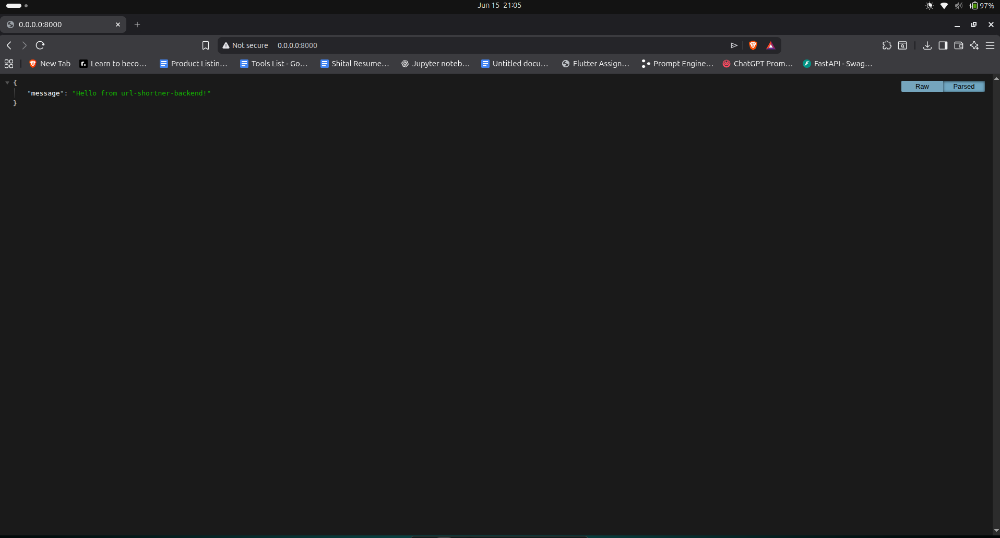
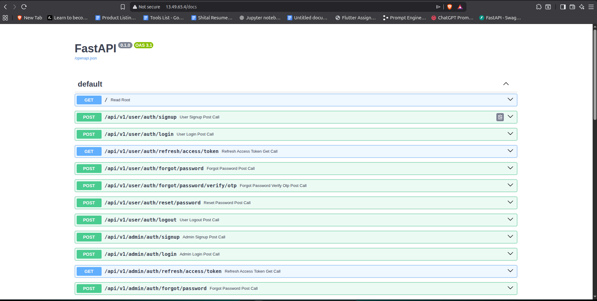
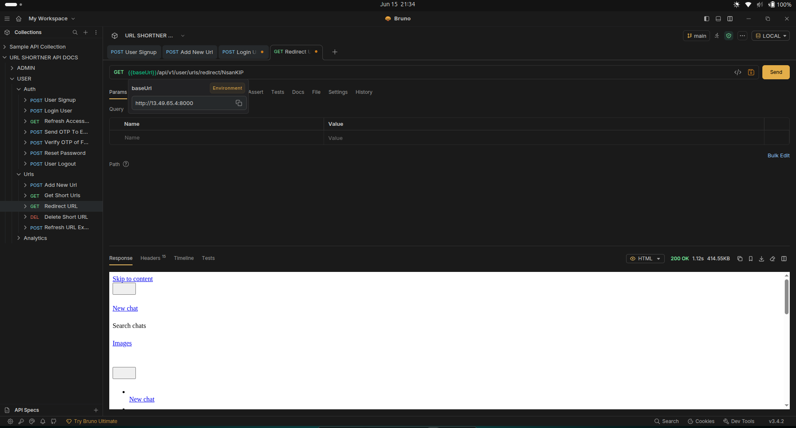
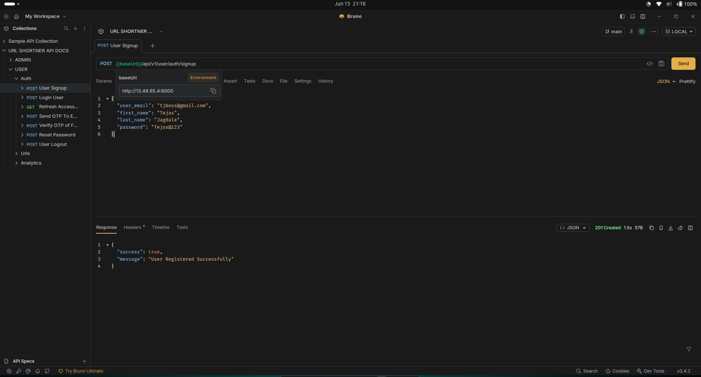
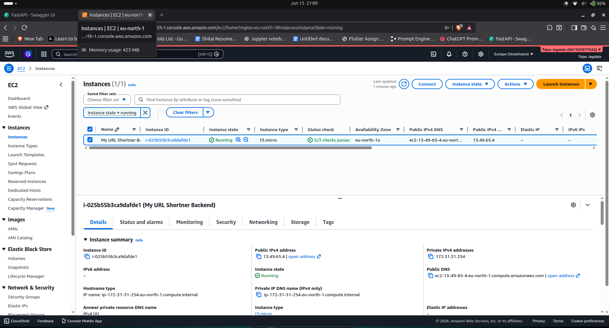

<div align="center">

# ⚡ URL Shortener Backend

**A production-grade URL shortening service — built to scale, secured to trust, deployed to the cloud.**

[](https://fastapi.tiangolo.com/)
[](https://www.postgresql.org/)
[](https://redis.io/)
[](https://www.docker.com/)
[](https://aws.amazon.com/ec2/)
[](https://github.com/features/actions)
[](LICENSE)

</div>

---

## 📌 Overview

A fully-featured URL Shortener backend engineered with **FastAPI**, deployed on **AWS EC2**, and backed by **PostgreSQL** and **Redis**. From JWT-based auth with HttpOnly cookies to role-based analytics and automatic URL expiration — every layer is production-ready.

---

## 🏗️ Architecture

```
                ┌──────────────┐
                │    Client    │
                └──────┬───────┘
                       │ HTTPS
                       ▼
                ┌──────────────┐
                │    Nginx     │  ← Reverse Proxy
                └──────┬───────┘
                       │
                       ▼
                ┌──────────────┐
                │   FastAPI    │  ← Application Layer
                └──────┬───────┘
                       │
        ┌──────────────┴──────────────┐
        ▼                             ▼
 ┌──────────────┐             ┌──────────────┐
 │    Redis     │             │  PostgreSQL  │
 │    Cache     │             │   Database   │
 └──────────────┘             └──────────────┘
```

---

## 🚀 Features

### 🔐 Authentication
| Feature | Details |
|---|---|
| JWT Auth | Access Token + Refresh Token |
| Cookie Security | HttpOnly Cookies — XSS-safe |
| OTP Password Reset | Time-limited OTP via Resend Email |
| Signup / Login / Logout | Full auth lifecycle |

### 🔗 URL Management
- Create short URLs with automatic expiry
- View, delete, and refresh your URLs
- Lightning-fast redirects via Redis cache
- Paginated URL listings

### 📊 Analytics

**User-Level**
- Total URLs created
- Total clicks & unique visitors
- Click timestamps & history

**Admin-Level**
- Platform-wide usage insights
- Total users, URLs, and clicks
- Cross-user analytics

### ⚙️ DevOps
- Fully Dockerized with Docker Compose
- Nginx as reverse proxy
- AWS EC2 deployment
- GitHub Actions CI pipeline (lint, format, Docker build)

---

## 🛠️ Tech Stack

| Layer | Technology |
|---|---|
| Framework | FastAPI + Pydantic |
| ORM | SQLAlchemy + Alembic |
| Database | PostgreSQL |
| Cache | Redis |
| Auth | JWT + HttpOnly Cookies |
| Email | Resend |
| Containerization | Docker + Docker Compose |
| Reverse Proxy | Nginx |
| Cloud | AWS EC2 |
| CI | GitHub Actions |

---

## 📂 Project Structure

```
src/
├── configs/            # App & DB configuration
├── dependencies/       # FastAPI dependency injection
├── modules/
│   ├── auth/
│   │   ├── admin/      # Admin auth routes
│   │   └── user/       # User auth routes
│   ├── urls/
│   │   └── user/       # URL management
│   └── analytics/
│       ├── admin/      # Admin analytics
│       └── users/      # User analytics
├── routes/             # Route registration
├── templates/          # Email templates
├── scripts/            # Utility scripts
└── utils/              # Helpers & shared logic
```

---

## 📸 Screenshots

### 🌐 Live Deployment on AWS EC2

The application is live and accessible on an AWS EC2 instance behind Nginx.



---

### 📋 All API Routes (Swagger UI)

Every endpoint is documented and explorable via FastAPI's built-in Swagger interface.



---

### 🔗 URL Redirect in Action

Short URLs resolve and redirect users correctly — cached via Redis for near-instant response.



---

### 👤 User Registration on Live Server

Signup works end-to-end on the deployed EC2 instance — JWT tokens issued, cookies set.



---

### ☁️ AWS EC2 Deployment

The full stack running on EC2 with Docker Compose, PostgreSQL, Redis, and Nginx.



---

## ⚙️ Environment Variables

Create a `.env` file in the project root:

```env
# PostgreSQL
POSTGRES_USERNAME=
POSTGRES_PASSWORD=
POSTGRES_HOST=
POSTGRES_PORT=5432
POSTGRES_DB=

# JWT
JWT_SECRET_KEY=
JWT_ALGORITHM=HS256
ACCESS_TOKEN_EXPIRE_MINUTES=15
REFRESH_TOKEN_EXPIRE_DAYS=7

# Redis
REDIS_HOST=localhost
REDIS_PORT=6379
REDIS_PASSWORD=

# Resend (Email)
RESEND_API_KEY=
RESEND_EMAIL_DOMAIN=
RESEND_FROM_EMAIL=

# App
APP_NAME=URL Shortener
PASSWORD_RESET_OTP_EXPIRE_MINUTES=5
BASE_URL=
```

---

## 🧑‍💻 Local Development Setup

```bash
# 1. Clone the repo
git clone https://github.com/tjeight/url-shortner-backend.git
cd url-shortner-backend

# 2. Install dependencies (using uv)
uv sync --dev

# 3. Set up pre-commit hooks
uv run pre-commit install

# 4. Run database migrations
uv run alembic upgrade head

# 5. Start the dev server
uv run fastapi dev main.py
```

Swagger UI available at: `http://localhost:8000/docs`

---

## 🐳 Docker Setup

```bash
# Build and start all services
docker compose up -d --build

# Stop all services
docker compose down

# Tail logs
docker compose logs -f
```

---

## ☁️ AWS EC2 Deployment

The application runs on EC2 using Docker Compose with all services containerized:

```
GitHub Push
    │
    ▼
GitHub Actions CI (lint + build check)
    │
    ▼
AWS EC2 Instance
    │
    ▼
Docker Compose
    ├── FastAPI (App)
    ├── PostgreSQL (Database)
    ├── Redis (Cache)
    └── Nginx (Reverse Proxy)
```

---

## 🔄 GitHub Actions CI

Automated checks run on every push:

| Check | Tool |
|---|---|
| Dependency installation | `uv` |
| Linting | `ruff` |
| Format check | `ruff format` |
| Docker build validation | `docker compose build` |

Workflow: `.github/workflows/ci.yml`

---

## 📈 Roadmap

- [ ] Custom short URL slugs
- [ ] QR Code generation
- [ ] HTTPS via Let's Encrypt
- [ ] Rate limiting
- [ ] Automated test suite
- [ ] CD pipeline via GitHub Actions
- [ ] Click analytics dashboard
- [ ] Geographic analytics

---

## 👨‍💻 Author

**Tejas** — Backend Developer

Focused on FastAPI · PostgreSQL · Redis · System Design · Cloud Deployment · AI Engineering

> *Built with care for performance, security, and clean architecture.*

---

## 📜 License

This project is licensed under the [MIT License](LICENSE).